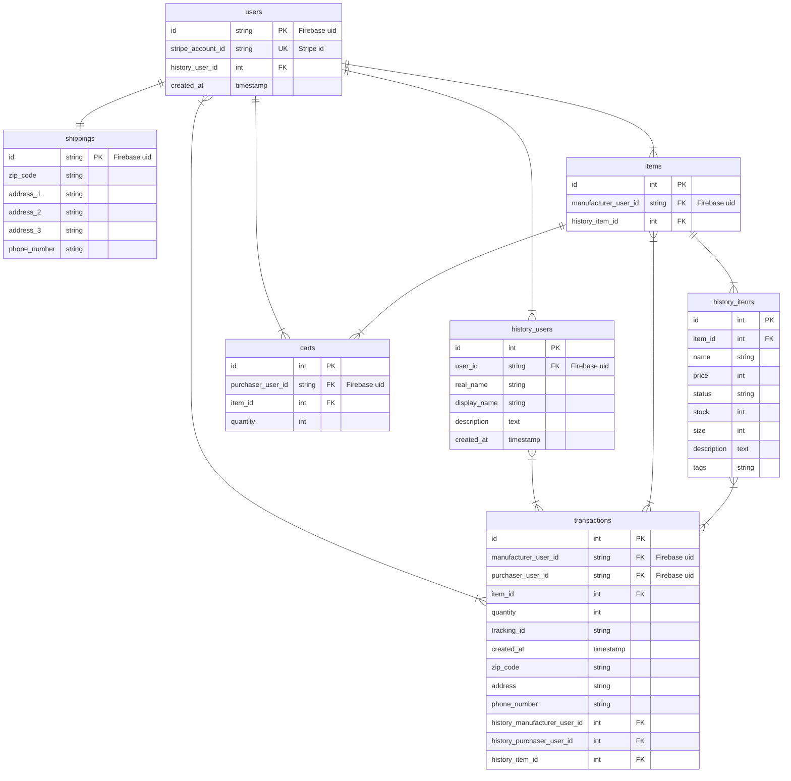

# CharisWorks-BackEnd

## Database Design

```mermaid
erDiagram

users ||--|{ history_users:""
users ||--|| shippings:""
users ||--|{ items:""
users }|--|{ transactions:""
users ||--|{ carts:""
history_users }|--|{ transactions:""
items ||--|{ history_items:""
items }|--|{ transactions:""
items ||--|{ carts:""
history_items }|--|{ transactions:""


users {
    id string PK "Firebase uid"
    stripe_account_id string UK "Stripe id"
    history_user_id int FK
    created_at timestamp
}

history_users {
    id int PK
    user_id string FK "Firebase uid"
    real_name string
    display_name string
    description text
    created_at timestamp
}

shippings {
    id string PK "Firebase uid"
    zip_code string
    address_1 string
    address_2 string
    address_3 string
    phone_number string
}

items {
    id int PK
    manufacturer_user_id string FK "Firebase uid"
    history_item_id int FK
}

history_items {
    id int PK
    item_id int FK
    name string
    price int
    status string
    stock int
    size int
    description text
    tags string
}

transactions {
    id int PK
    manufacturer_user_id string FK "Firebase uid"
    purchaser_user_id string FK "Firebase uid"
    item_id int FK
    quantity int
    tracking_id string
    created_at timestamp
    zip_code string
    address string
    phone_number string
    history_manufacturer_user_id int FK
    history_purchaser_user_id int FK
    history_item_id int FK
}

carts {
    id int PK
    purchaser_user_id string FK "Firebase uid"
    item_id int FK
    quantity int
}

```